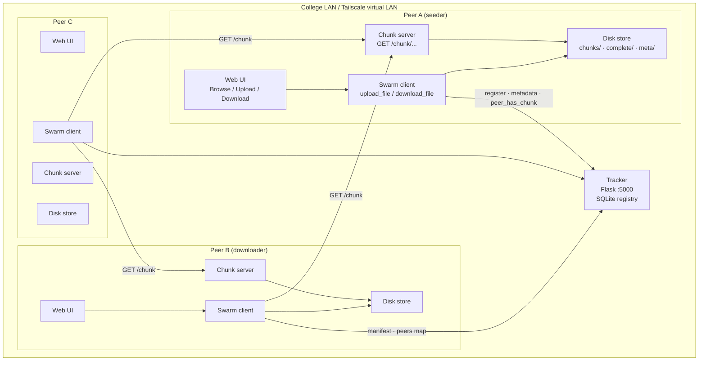
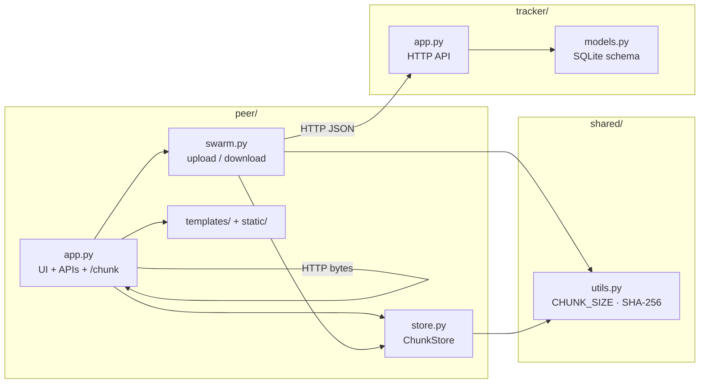
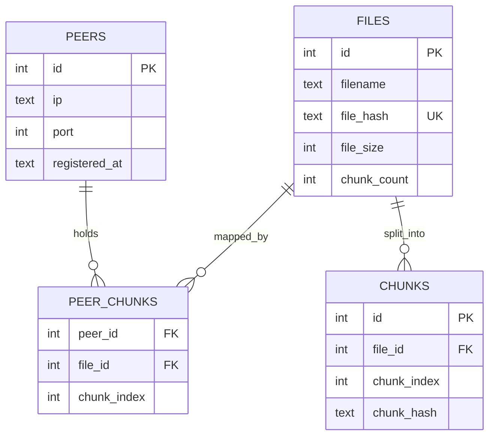
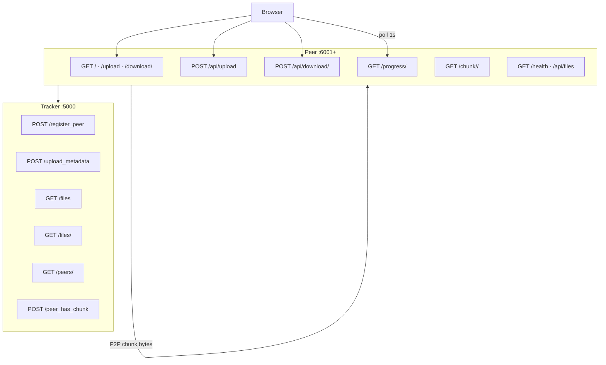
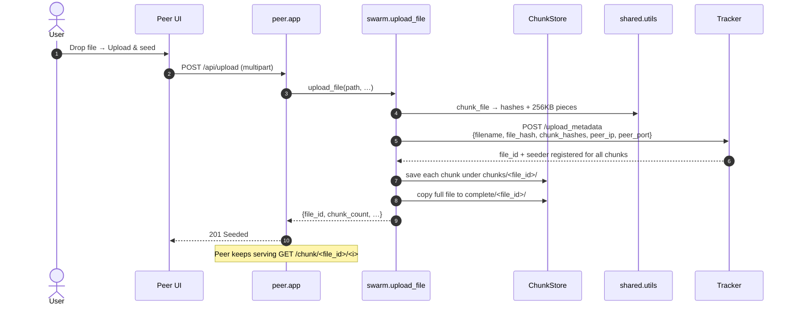
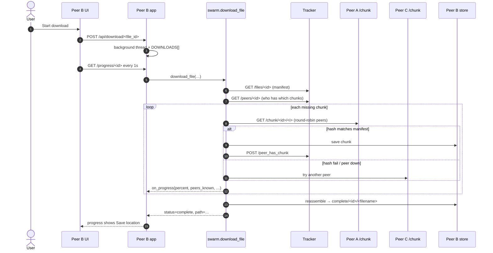
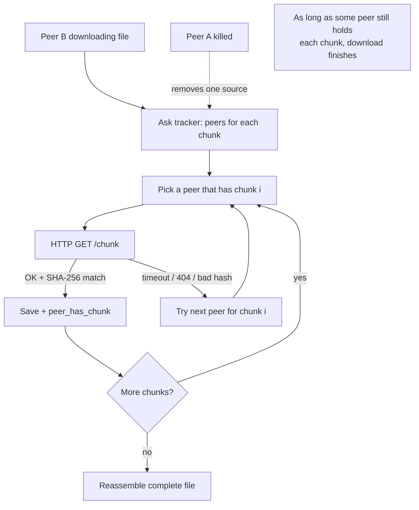
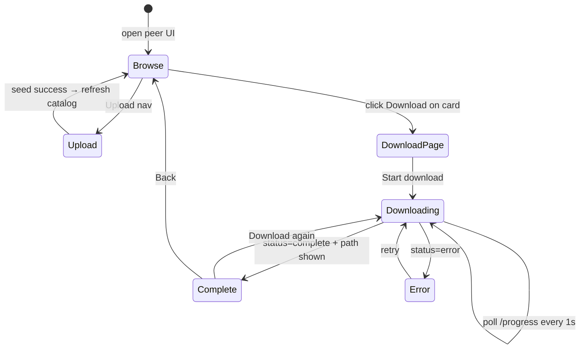
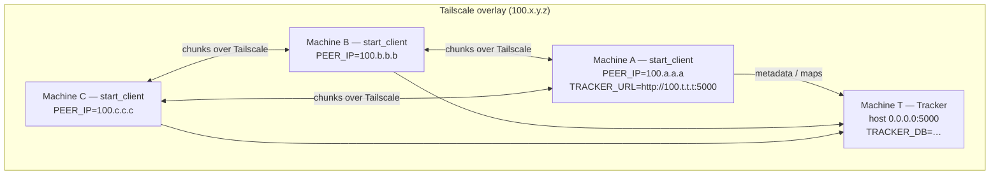

# NightOwls-26 — Architecture & Flow Diagrams

Educational BitTorrent-style LAN file sharing: one **tracker** (catalog + peer map) and many **peers** (seed, download, serve 256 KB SHA-256-verified chunks over HTTP).

---

## 1. High-level system architecture



**Roles**

| Piece | Responsibility |
|-------|----------------|
| Tracker | Files, chunk manifests, which peer has which chunk |
| Peer UI | Human browse / upload / progress |
| Swarm | Chunk, hash, fetch, verify, reassemble, report |
| Chunk server | Serve local pieces to other peers |
| Shared utils | 256 KB split + SHA-256 |

---

## 2. Code / component map



---

## 3. Tracker data model



---

## 4. HTTP surface



---

## 5. Upload / seed flow



---

## 6. Download / swarm flow



---

## 7. Resilience (peer dies mid-download)



---

## 8. UI interaction flow



**Progress JSON contract** (polled by the UI):

```text
status, percent, chunks_have, chunks_total, peers_known, path, error, data_dir, downloads_dir
```

Completed files are always under:

```text
<PEER_DATA_DIR>/complete/<file_id>/<filename>
```

---

## 9. Tailscale / LAN deployment



**Launch helpers**

| OS | Script |
|----|--------|
| Linux / macOS | `./scripts/start_client.sh http://<tracker-ts-ip>:5000` |
| Windows | `scripts\start_client.bat http://<tracker-ts-ip>:5000` |
| Local multi-peer demo | `./scripts/run.sh --seed` |

---

## 10. End-to-end happy path (one picture)

```mermaid
flowchart LR
  U1["1. Peer A uploads file"] --> U2["2. Chunk + SHA-256"]
  U2 --> U3["3. Tracker stores manifest<br/>+ Peer A has all chunks"]
  U3 --> U4["4. Peer B browses GET /files"]
  U4 --> U5["5. B fetches chunks from A<br/>(and later from others)"]
  U5 --> U6["6. B verifies each chunk"]
  U6 --> U7["7. B reports peer_has_chunk"]
  U7 --> U8["8. B reassembles file<br/>→ complete/… path shown in UI"]
  U8 --> U9["9. Peer C can pull from A and B"]
```



---

## Quick mental model

> **Tracker = phone book.** **Peers = actual file pieces.**  
> Discovery always goes through the tracker; bytes move peer-to-peer over HTTP `/chunk/...` with SHA-256 checks so a dead seeder only slows you down if no other peer holds those pieces.
